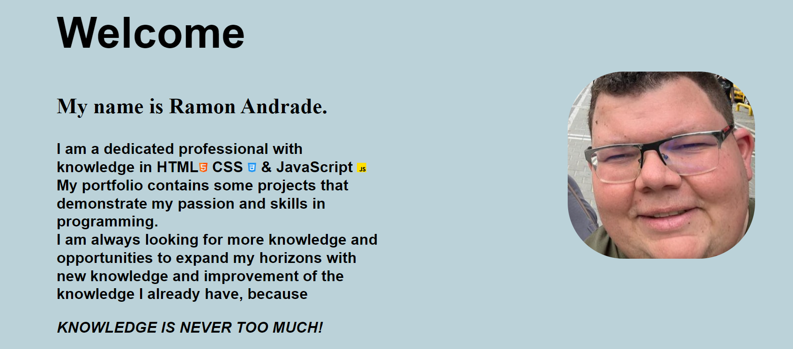
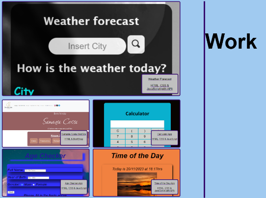
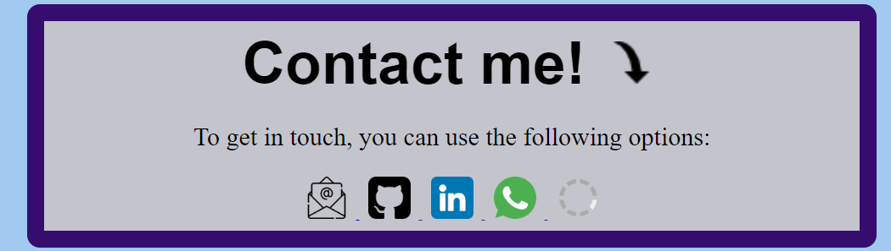

# Ramon's Portfolio

This is the repository that contains the source code and files related to my personal portfolio. This portfolio highlights some of the projects and work I have been working on.

## Content

- [About Me](#about-me)
- [Projects](#projects)
- [Technologies](#technologies)
- [Contact](#contact)

## About me

I am Ramon, a developer passionate about creating innovative solutions and solving challenging problems. My experience includes:HTML, CSS, JavaScript and BootStrap.

## Projects

### Portfolio
 Live https://ramon-portfolio.vercel.app/
- Screen above 1050px

- Screen below 1049pc

#### NavBar 
- Contains logo and button that directs to the exact location of the page

#### Welcome
- Contains a brief text describing a little about me

#### Work 
- Contains some of my projects carried out during my apprenticeship

#### Contact 
- Contains ways to contact me and my social network

### Project in the portfolio

Here are some of the projects highlighted in my portfolio:

1. Weather Forecast 
    - Current weather checking app. Shows current temperature, relative humidity and whether the sky is clear, cloudy, etc...
    - Technologies used: HTML, CSS, JavaScript and using the api resource.
    - Live: https://weather-pkoejl4ub-ramonsaguini.vercel.app/ 
    - Repository: https://github.com/ramonsaguini/weather 
    
    
    
2. Samanta Costa Website
    - Hair Dresser website..
    - Technologies used: HTML and BootStrap
    - Live: https://site-88uh6wqe1-ramonsaguini.vercel.app/ 
    - Repository: https://github.com/ramonsaguini/siteSam 

    

3. Calculator
    - Application for performing numerical calculations.
    - Technologies used: HTML, CSS and JavaScript
    - Live: https://ramonsaguini.github.io/Calculator/ 
    - Repository: https://github.com/ramonsaguini/Calculator

    

4. Age Checker
    - Application to check how old you are today based on your year of birth.
    - Technologies used: HTML, CSS and JavaScript
    - Live: https://ramonsaguini.github.io/ageCheck/ 
    - Repository: https://github.com/ramonsaguini/ageCheck 

    

5. Time of the day.
    - Application that shows you the time and complete date of the current day.
    - Technologies used: HTML, CSS, JavaScript and using the api resource.
    - Live: https://ramonsaguini.github.io/timeOfTheDay/ 
    - Repository: https://github.com/ramonsaguini/timeOfTheDay 

    

## Technologies

Some of the technologies I'm comfortable with include:

- HTML
- CSS
- JavaScript(in advance of learning)
- BootStrap(in advance of learning)

## Contact

- Email: ramon_saguini1@hotmail.com
- LinkedIn: https://www.linkedin.com/in/ramon-saguini-de-andrade-a40728277/
- GitHub: https://github.com/ramonsaguini

Feel free to explore my projects and get in touch if you have any questions or collaboration opportunities.